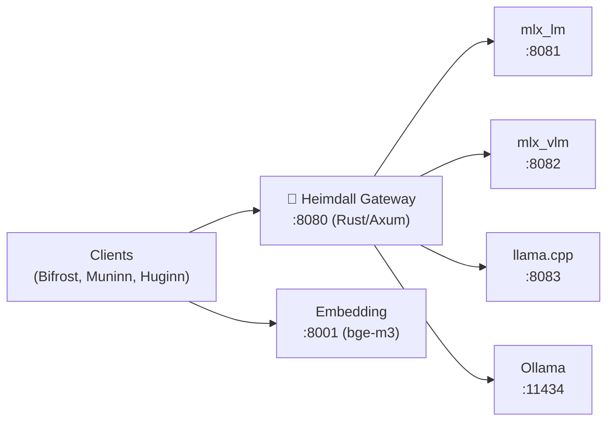

# SI-01: Software Implementation Report — Heimdall

**Product:** 🔭 Heimdall (LLM Gateway)
**Document ID:** SI-RPT-HEIMDALL-001
**Version:** 0.1.0
**Date:** 2026-03-18
**Standard:** ISO/IEC 29110 — SI Process
**Stack:** 🦀 Rust (Axum) + 🐍 Python (MLX)

---

## 1. Product Overview

| Field | Value |
|:--|:--|
| **Repository** | MegaWiz-Dev-Team/Heimdall |
| **Port** | `:8080` (Gateway), `:8081` (MLX), `:8001` (Embedding) |
| **Running** | Host machine (GPU/MLX required) |
| **Dependencies** | MLX, llama.cpp, Ollama, vLLM (backends) |

---

## 2. Architecture

## 3. Functional Requirements

| FR | Description | Status |
|:--|:--|:--|
| FR-H01 | OpenAI-compatible `/v1/chat/completions` API | ✅ Done |
| FR-H02 | Multi-backend routing (MLX, Ollama, llama.cpp) | ✅ Done |
| FR-H03 | API key authentication | ✅ Done |
| FR-H04 | SSE streaming responses | ✅ Done |
| FR-H05 | Prometheus metrics | ✅ Done |
| FR-H06 | MLX embedding server (bge-m3) | ✅ Done |
| FR-H07 | Benchmark suite + history | ✅ Done |
| FR-H08 | Model catalog (SQLite) | ✅ Done |

## 4. API Endpoints

| Method | Path | Description |
|:--|:--|:--|
| `GET` | `/health` | Health check |
| `GET` | `/v1/models` | List available models |
| `POST` | `/v1/chat/completions` | Chat completion (OpenAI-compatible) |
| `POST` | `/v1/embeddings` | Text embeddings (bge-m3) |

## 5. Configuration

| Variable | Default | Description |
|:--|:--|:--|
| `GATEWAY_PORT` | `8080` | Gateway port |
| `BACKEND_PORT` | `8081` | MLX backend port |
| `BACKEND_ENGINE` | `mlx` | Backend engine |
| `LLM_MODEL` | `Qwen3.5-9B-MLX-4bit` | Default model |
| `EMBEDDING_MODEL` | `BAAI/bge-m3` | Embedding model |
| `EMBEDDING_PORT` | `8001` | Embedding server port |

---

*บันทึกโดย: AI Assistant (ISO/IEC 29110 SI Process)*
*Created: 2026-03-18 by Antigravity*
