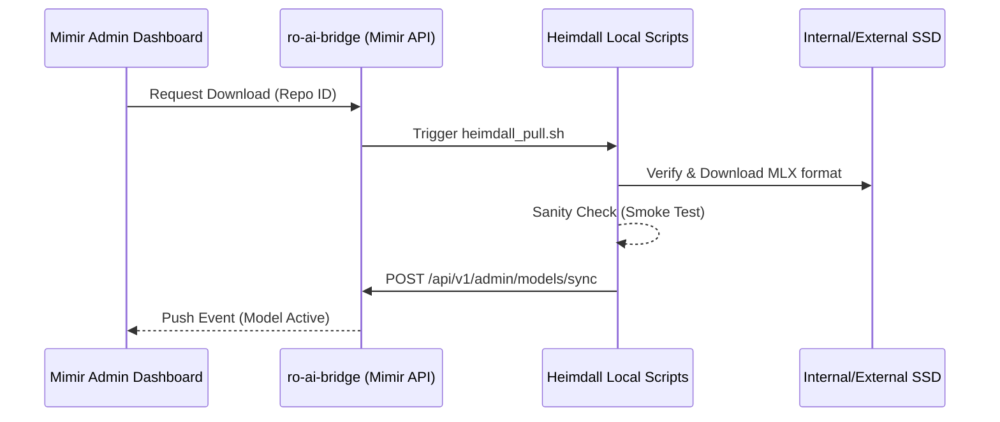

# Heimdall Model Ingestion Pipeline (Proposed Architecture)

> [!NOTE]  
> This document outlines the proposed architectural design for automating the lifecycle of LLM models within the Asgard AI Platform Ecosystem (Heimdall Inference Engine + Mimir Backend). It provides a structural blueprint for future implementation.

## Overview
Currently, models in Heimdall are managed manually via CLI downloads and orchestrated across SSD storage using `model_manager.sh`. Mimir tracks available models, but the synchronization process is detached. This architecture proposes a highly automated **Autonomic Model Ingestion Pipeline** bridging the hardware, storage layer, and the Mimir API Backend.

## The 4-Stage Architecture Workflow



### Stage 1: Preparation & Ingestion (Heimdall Level)
**Objective:** Safely download and validate models optimized for Apple Silicon (MLX).
- **Process:** A new script `heimdall_pull.sh` wrapping `huggingface-cli download`.
- **Validation:** 
  - Ensure the repository specifically targets `mlx-community` or contains `.safetensors` alongside `config.json` and `tokenizer.json`.
  - Automatically reject `GGUF` formats that lack proper MLX conversion mappings.
- **Verification:** Automatically run a lightweight script (e.g. `python3 scripts/sanity_test.py "Hello!"`) to verify there are no memory corruption or loading shape mismatches immediately after download.

### Stage 2: Mimir Auto-Registration (Backend Synchronization)
**Objective:** Maintain exactly matched states between Heimdall's local storage and the Mimir database (`GET /api/v1/models`).
- **New Internal API:** `POST /api/v1/admin/models/sync`
- **Execution:** Once Heimdall verifies a model, it initiates an HTTP webhook to Mimir containing the metadata.
- **Example Payload:** 
```json
{
  "model_id": "mlx-community/gemma-4-26b-a4b-it-4bit",
  "provider": "heimdall",
  "model_type": "llm",
  "capabilities": {
    "reasoning": true,
    "tools": true,
    "vision": false
  },
  "is_active": true
}
```

### Stage 3: Lifecycle Integration (Storage Layer)
**Objective:** Close the gap between hardware storage and the application routing layer.
- Ensure the existing `model_manager.sh` broadcasts events back to Mimir.
- **Archive Action:** When a model is offloaded to the External SSD via `model_manager.sh archive`, a curl command hits Mimir to set `is_active: false`. This immediately hides the model from user-facing drop-downs in the RAG Playground.
- **Restore Action:** Restoring the model triggers an `is_active: true` webhook to re-activate routing.

### Stage 4: Admin Visual Control Hub (UI Level)
**Objective:** Eliminate the need to SSH or run terminal scripts for model deployments.
- Build a "Model Hub" tab inside the Mimir Administrator Panel.
- Provide a persistent input for `HuggingFace Repo ID`.
- Integrate a WebSocket/SSE connection listening to the standard output of `huggingface-cli` to project real-time download bars directly into the web browser interface.

---

## 🎯 Appendix: Recommended Google Gemma 4 Configuration
If implementing the Gemma 4 pipeline, consider standardizing around these specific configurations from the `mlx-community` registry based on use-cases:

> [!TIP]
> **Heimdall Sweet Spot `gemma-4-26b-a4b-it-4bit`:**  
> Mixture-of-Experts architecture perfectly suited for low-latency generic Chat and autonomous agent interactions. Total parameters are 26B but active parameters are only 4B.

> [!IMPORTANT]  
> **Evaluator / Overseer `gemma-4-31b-it-4bit`:**  
> A dense model ensuring the highest reasoning accuracy. Reserve this exclusively for the `judge` LLM slot within the Mimir UniversalClient router for heavy evaluation matrix tasks.
